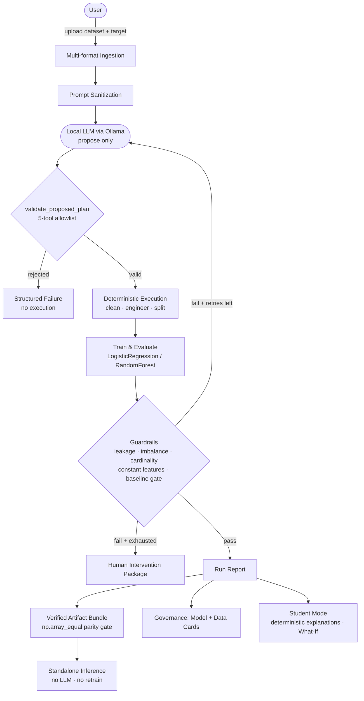

# PIPER — A Deterministic ML Compiler Powered by Local LLMs

> Upload a tabular dataset. Describe the prediction target. PIPER plans, executes, validates, and delivers a verified ML pipeline — deterministically, locally, without cloud APIs.

PIPER is an autonomous ML pipeline engine that combines a local LLM planner with a fully deterministic execution, validation, and artifact layer. The LLM **proposes** a plan; rigid Python rules **validate, execute, and decide** — the planner can never bypass guards, pick models, or generate governance reports.

**Architected for local execution on 16GB-class hardware with Ollama.**

---

## Architecture



---

## What PIPER Does

| Phase | What happens |
|---|---|
| **Ingestion** | CSV, TSV, Excel, JSON, Parquet, Jupyter Notebook — detected automatically |
| **Profiling** | Column types, missingness, cardinality, class distribution |
| **Sanitization** | Sample values scanned for prompt-injection patterns before reaching the LLM |
| **Planning** | Local LLM proposes a cleaning + feature engineering plan |
| **Validation** | `validate_proposed_plan()` enforces a fixed 5-tool allowlist — anything else is rejected before execution |
| **Execution** | Drop columns, impute, convert types, encode categoricals, scale numerics |
| **Training** | Logistic Regression and Random Forest — fit as one sklearn `Pipeline` on the training split only |
| **Evaluation** | F1, precision, recall, ROC-AUC; F1-max model selection (fixed in code, not LLM-choosable) |
| **Guardrails** | Leakage, class imbalance, constant features, high cardinality, suspicious metrics, baseline gate |
| **REPLAN** | On guardrail failure: structured replan prompt with previous failure evidence and plan diff |
| **Duplicate Detection** | Plan hashes catch identical retry proposals as `DUPLICATE_PLAN` |
| **Artifacts** | `pipeline.joblib`, `pipeline.py`, reproduction notebook, SHA-256 hashes, `evidence.json` — only after `np.array_equal` parity passes |
| **Governance** | Deterministic model cards, dataset cards, subgroup fairness analysis |
| **Deployment** | Standalone `/predict` endpoint; CSV Test Flight scoring against verified artifact |
| **Student Mode** | 14-stage learning journey, pipeline flowchart, "Why did PIPER do this?", metric explainers |
| **What-If** | Controlled single-variable experiments on existing runs (isolated IDs, original run untouched) |

---

## Design Constraints (Non-Negotiable)

1. **The LLM never controls routing.** Routing reads `validation.valid` and `retry_count` — never plan content, never LLM output.
2. **No automatic plan repair.** Invalid plans are rejected wholesale, not partially patched.
3. **Explanations are never LLM-generated.** Every explanation is a deterministic template filled with recorded run values.
4. **Artifact parity is exact.** `np.array_equal` — not `np.allclose`. Approximate agreement is rejected.
5. **Inference never retrains.** The standalone predict endpoint loads the verified `pipeline.joblib` only.

---

## Prerequisites

- **Python 3.11+**
- **Node.js 20+** with npm
- **[Ollama](https://ollama.com)** running locally with a model pulled:
  ```bash
  ollama pull qwen3:4b
  ```

Ollama always runs **outside** Docker/PIPER — PIPER connects to it via HTTP.

---

## Setup

### Linux / macOS

```bash
git clone <repo-url> piper && cd piper
bash setup.sh
```

### Windows (PowerShell)

```powershell
git clone <repo-url> piper; cd piper
.\setup.ps1
```

Both scripts:
- Check Python 3.11+ and Node.js 20+
- Create a `.venv` virtual environment
- Install pinned Python dependencies (`requirements.txt`)
- Install frontend dependencies (`npm install`)
- Create `data/` and `artifacts/` directories
- Check Ollama connectivity and model availability

### Copy the environment template (optional)

```bash
cp .env.example .env   # edit to override any defaults
```

---

## System Check

```bash
python check.py
```

Expected output:

```
PIPER SYSTEM CHECK
────────────────────────────────────────────────
  ✓  Python version             3.11.x
  ✓  Python dependencies        all required packages found
  ✓  Directory data/            .../data
  ✓  Directory artifacts/       .../artifacts
  ✓  Ollama server              http://localhost:11434
  ✓  Planner model              qwen3:4b
  ✓  SQLite database            data/piper_runs.sqlite

PIPER READY
```

---

## Start

### Linux / macOS

```bash
bash run.sh
```

### Windows (PowerShell)

```powershell
.\run.ps1
```

- **Frontend:** http://localhost:5173
- **Backend API:** http://localhost:8000 (Swagger docs at `/docs`)

### Or start each process manually

**Linux / macOS:**

```bash
# Terminal 1 — backend
cd backend
../.venv/bin/uvicorn app.main:app --reload

# Terminal 2 — frontend
cd frontend
npm run dev
```

**Windows (PowerShell):**

```powershell
# Terminal 1 — backend
cd backend
..\.venv\Scripts\python.exe -m uvicorn app.main:app --reload

# Terminal 2 — frontend
cd frontend
npm run dev
```
---

## Sample Workflow

1. Open **http://localhost:5173**
2. Upload **`data/raw/telco_customer_churn.csv`** (included in the repo)
3. Set target column: **`Churn`**
4. Click **Start Run** — watch the live SSE event feed
5. When complete:
   - **Engineer Mode**: Decision trace, model comparison chart, guardrail checks, governance cards, artifact export
   - **Student Mode**: Learning journey, "Why did PIPER do this?", What-If experiments

### Try failure handling deliberately

Add a column that duplicates the target. The leakage guardrail detects it, PIPER replans, and — when the retry budget is exhausted — returns a structured `HUMAN_INTERVENTION_REQUIRED` package with exact evidence and recommended actions.

---

## API Quick Reference

```bash
# Upload dataset
curl -X POST http://localhost:8000/datasets \
  -F "file=@data/raw/telco_customer_churn.csv"

# Start run
curl -X POST http://localhost:8000/runs \
  -H "Content-Type: application/json" \
  -d '{"dataset_id":"<id>","target_column":"Churn"}'

# Live events
curl -N http://localhost:8000/runs/<run_id>/events

# Student Mode explanation
curl http://localhost:8000/runs/<run_id>/learn/explanation

# One-variable What-If experiment
curl -X POST http://localhost:8000/runs/<run_id>/explore \
  -H "Content-Type: application/json" \
  -d '{"variable": "algorithm", "value": "random_forest"}'
```

Full API reference: `/docs` when the backend is running.

---

## Configuration

All variables are optional. Defaults work out of the box with a local Ollama install.

| Variable | Default | Description |
|---|---|---|
| `PIPER_OLLAMA_HOST` | `http://localhost:11434` | Ollama server URL |
| `PIPER_LLM_MODEL` | `qwen3:4b` | Planner model (any Ollama-compatible model) |
| `PIPER_OLLAMA_TIMEOUT_SECONDS` | `600.0` | Per-socket timeout for Ollama calls |
| `PIPER_OLLAMA_TOTAL_DEADLINE_SECONDS` | `900.0` | Hard wall-clock deadline per planning call |
| `PIPER_OLLAMA_KEEP_ALIVE` | `10m` | Model keep-alive to avoid REPLAN cold-reload penalty |
| `PIPER_RUN_STORE` | `sqlite` | `sqlite` (persistent) or `memory` |
| `PIPER_SQLITE_PATH` | `data/piper_runs.sqlite` | SQLite database path |
| `PIPER_ARTIFACT_DIR` | `artifacts` | Directory for exported ML artifact bundles |
| `PIPER_CORS_ORIGINS` | `http://localhost:5173,...` | CORS origins for the API |

See `.env.example` for the full annotated template.

---

## Planner Model & Hardware Notes

PIPER's deterministic safety guarantees are **independent of the planner model**.
The model only proposes plans; PIPER's validator, guardrails, and routing make all decisions.

| Model | Typical latency | Notes |
|---|---|---|
| `qwen3:4b` | 143–418s per call (CPU, Telco dataset) | Documented baseline; ~2/10 single-shot success |
| `qwen3:8b` | ~400–460s per call (CPU) | Higher adherence to the planning schema |
| `qwen3:14b`+ | — | Better schema compliance; requires more RAM |

**Documented benchmark result:** `qwen3:4b`, 10 independent real Telco runs, CPU inference:
- 2/10 complete end-to-end success
- 8/10 trigger at least one REPLAN or exhaust the retry budget
- All failures produce structured, bounded, explainable outcomes

When planning fails, PIPER safely intercepts via deterministic REPLAN, duplicate detection, and structured intervention packages — no uncaught exceptions, no silent corruption.

---

## Tests

```bash
# Backend (1003 passing, 5 skipped — Ollama integration, gated behind env var)
cd backend && pytest tests/ -q

# Frontend (39 passing)
cd frontend && npm test -- --run

# Frontend production build
cd frontend && npm run build

# Ollama integration tests (requires live Ollama + model)
PIPER_RUN_OLLAMA_TESTS=1 pytest backend/tests/test_ollama_integration.py -q
```

---

## Project Layout

```
PIPER/
├── backend/
│   ├── app/                # LangGraph graph, plan nodes, validation, tools
│   │   ├── agent/          # Agent graph and deterministic execution tools
│   │   ├── artifacts/      # Bundle export, SHA-256 hashes, parity gate
│   │   ├── deployment/     # Standalone inference, Test Flight, readiness
│   │   ├── governance/     # Model cards, data cards, fairness analysis
│   │   ├── learning/       # Student Mode: explanations, concept registry
│   │   ├── llm/            # OllamaProvider protocol + client
│   │   ├── schemas/        # Pydantic contracts (every structured type)
│   │   ├── storage/        # SQLite run store, in-memory stores
│   │   └── api/            # FastAPI routers
│   ├── tests/              # 1003-test behavioral suite
│   ├── Dockerfile          # Backend container image definition
│   ├── Dockerfile.dockerignore
│   └── pytest.ini
├── frontend/
│   ├── src/
│   │   ├── features/       # Runs, artifacts, governance, student, settings
│   │   ├── pages/          # HomePage, RunPage, HistoryPage
│   │   └── lib/            # API client, SSE hooks, types
│   ├── Dockerfile          # Frontend container image definition
│   ├── nginx.conf
│   └── package.json
├── data/raw/               # Reference dataset (Telco Customer Churn)
├── benchmark_data/         # Test fixture dataset (Titanic)
│   └── train.csv
├── benchmark_results/      # Recorded empirical benchmark evidence
├── check.py                # PIPER system readiness check
├── setup.sh / setup.ps1    # One-command setup (Linux/macOS / Windows)
├── run.sh / run.ps1        # One-command launcher
├── .env.example            # Configuration template
├── docker-compose.yml      # Docker Compose (backend + frontend)
├── LICENSE                 # MIT License
└── requirements.txt        # Pinned Python dependencies
```

---

## Limitations

- **Binary and multiclass tabular classification only.** No regression, time-series, text, images.
- **Two candidate algorithms** (Logistic Regression, Random Forest), fixed in code. The LLM cannot introduce new model families.
- **Local small models have low single-shot planning success rates.** This is a documented, bounded failure mode — not a silent one.
- **`valid=True` means no implemented guardrail found a violation**, not that the pipeline is provably optimal.
- **In-process storage** for datasets, splits, and models. SQLite for run history. Nothing persists across restarts except run history and artifact bundles on disk.
- **Single-variable What-If scope.** Experiments change exactly one thing to preserve comparability.
- **No auth, multi-tenancy, or horizontal scaling.** Local/demo target only.

---

## Docker

```bash
# Requires Ollama already running on the host
docker compose up --build
```

Frontend: http://localhost:5173 · Backend: http://localhost:8000

Override any configuration in `.env` (docker-compose reads it automatically).

---

## License

MIT
